Flavorを使った環境分けとFirebase Cloud Messageの対応

# はじめに

この記事ではAndroidやiOSの事をネイティブと呼びます

この記事のプロジェクトのgithubは[こちらです](https://github.com/shirobutton/flutter_flavor_example)
githubのコミットを参照する形で進めます。

環境としては以下を作ります。
+ Debug-dev
+ Debug-stg
+ Debug-prod
+ Release-prod

環境分けの対象には以下を想定しています。
+ applicationId(bundleId)
+ アプリ名
+ Firebaseの設定ファイル(google-services.json, GoogleService-Info.plist)

今回は取り上げませんが、
APIのエンドポイントなどFlutter側で使用する変数も簡単に環境分けできます。

またこちらも今回は使用しませんが、
FlutterでFirebaseを使用するにはFlutterFire CLIというものもあります。
これはFlutter側でFirebaseの対応ができるため、ネイティブ側を触らなくて良くメリットは大きいです。
しかし、FlutterFire CLIはflavorの対応が完全ではなく、
現在はFirebaseの設定ファイルを各OSに配置する方が安全そうです。
関連issue: https://github.com/invertase/flutterfire_cli/issues/14

FlutterFire CLIを使用したい場合はこちらの記事が参考になります。
https://zenn.dev/flutteruniv_dev/articles/20220904-151314-flutter-fire-flavor

# Flutterの環境分け

Flutter環境分けには二つのパターンがあります。
1. dart-defineのみを使う方法
2. dart-defineとflavorを使う方法

どちらも大きな違いはありませんが、
今回はflavorを使用した方法を紹介します。
flavorを使用しない場合はこちらの記事が参考になります。
https://zenn.dev/altiveinc/articles/separating-environments-in-flutter

FlutterFire CLIを使用しない場合、
flavorを使用してもしなくてもiOSにFirebase用のスクリプトを登録する必要があります。

## 1. dart-defineのみを使う方法

flavorを使わずに、dart-defineの環境変数だけで、環境分けをします。
一番シンプルな方法です。基本的にこちらを選ぶことが多いと思います。

flavorを使った場合との違いについては、
AndroidでFirebaseの設定ファイルをコピーするコードをgradleに書く必要がありますが、
iOSでschemeを追加する必要がありません。

## 2. dart-defineとflavorを使う方法

`flutter run`などのコマンドに`--flavor dev`などのflavorをつける方法です
dart-defineと組み合わせて使います。
ネイティブ側でも環境分けしたい場合はこちらを使用すると思います。

`--flavor`をつけるとネイティブ側のflavor用の機能が使えます。

dart-defineで環境変数としてflavorを設定しても
ネイティブ側のflavorを使用しているわけではないので、
flavorは`--flavor`でコマンドに付与する必要があります。

flavorを使うと
Androidの環境分けがFirebaseの設定ファイルをflavor用のディレクトリに配置するだけで良くなります。
その代わり、iOSでschemeとConfigurationを設定する必要があります

今回はこちらを使います。

# 環境変数を定義

まずは準備として環境変数用のファイルを追加します。
flavorフォルダを作ってそのなかにflavor用の.envファイルを作ります。
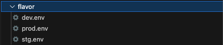

形式はjsonでも構いません。
内容としては以下のコミットのとおりです。
appIdやappNameは任意のものに変更してください
[commint: flavorごとの環境変数を追加](https://github.com/shirobutton/flutter_flavor_example/commit/2090255bebc474ccaaaca6bb89575df3b0efb49d)

このenvファイルをdart-defineで使います。
`flutter run`などのコマンドに`--dart-define-from-file=flavor/dev.env`などをつけて使用します。
こうする事で環境変数が使えます。

今回はflavor引数も使うのでコマンドが長いです。
いちいち入力するのは大変なので、
vscode用の`.launch.json`も追加しておきます。
AndroidStudioでも同様の設定ができます。
[commint: launch.jsonの追加](https://github.com/shirobutton/flutter_flavor_example/commit/aa87d690b83d5ed1f2f9972efc30ffa161944a81)

これでvscodeのdebugから環境を選択できるようになります
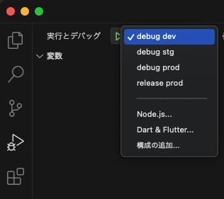


# Androidの環境分け

Androidの環境分けは簡単です。
Androidのgradleではenvファイルで設定した環境変数をそのまま使用することができます。

`android/app/build.gragle`で環境変数を使い、
AndroidManifestのlabelも編集します。
MainActivityのディレクトリをappIdに合うように変更してpackageも変更します

詳しくは以下の二つのコミットを参照してください
[commint: androidで環境変数を使う](https://github.com/shirobutton/flutter_flavor_example/commit/012a5b354f7d286cc9840181313b320148ea935d)
[commint: androidにflavorを追加](https://github.com/shirobutton/flutter_flavor_example/commit/3c1f4c742f164501e3ea12b8f72b37e9031edcee)

# iOSの環境分け

iOSでもenvで設定した環境変数をそのまま使用することができます。
ビルドすると`ios/Flutter/Generated.xcconfig`に出力されるのがわかります。

まずBundleIdentifierを`$appId$appIdSuffix`変更します

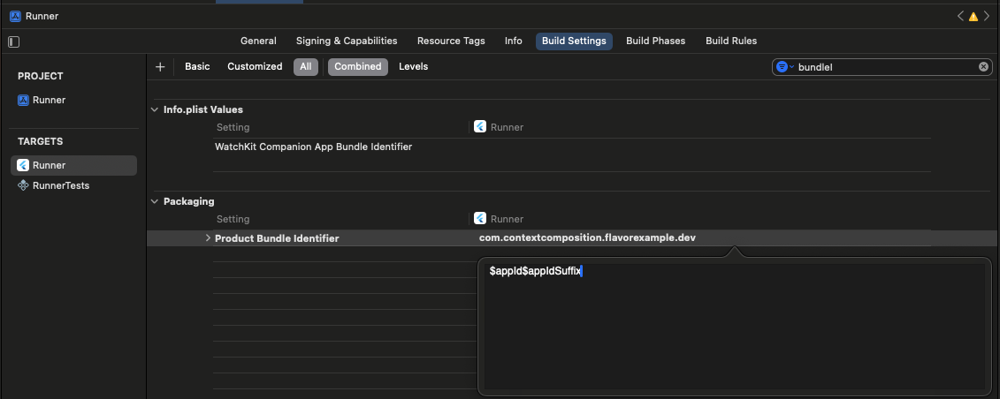

infoの`Bundle name`と`Bundle display name`を`$appName`に変更します

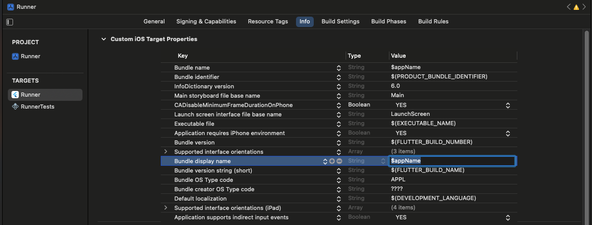

## Scheme追加

Flutterのflavorはiosのschemeを使用するのでschemeを追加します。

ManageSchemeを開きます

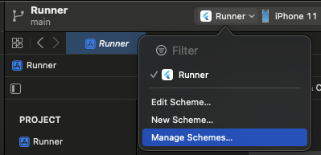

+ボタンを押してTargetはRunnerでschemeを追加します。

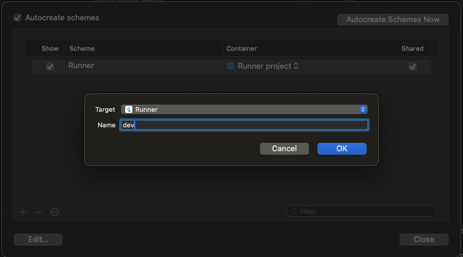

元々のschemeはprodにリネームして以下のようにします。

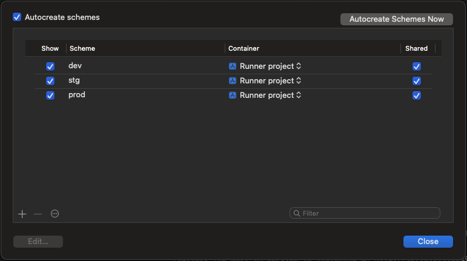

## Configration追加

つぎはConfigrationを追加します。

元々のDebugをDebug-devにリネームします。
左下の+ボタンからDuplicate Debug-devを選択して
Debug-stgとDebug-prodを作ります。
ReleaseはRelease-prodにリネームします。
他にも環境が欲しければ追加してください。

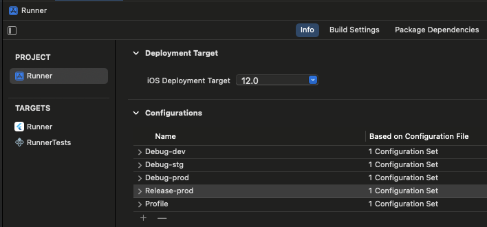

editSchemeを開いてSchemeごとのConfigrationを編集します。

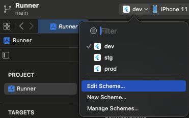

例えばstgだとこんな感じでいいと思います。
Release-stgのようなものが欲しければそちらもConfigrationで追加してください

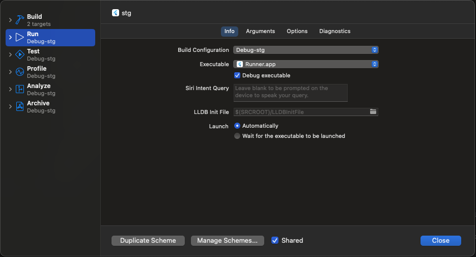

## AppleDevelopでの設定

このままだとビルドできないのでIdentifierとProfilesを追加します。
作成済みであれば読み飛ばしてください

とりあえずdev環境のものを作成してみます。

AppleDeveloperに行きます
https://developer.apple.com/account/resources/identifiers/list

identifiersの+ボタン押して道なりに進みます。

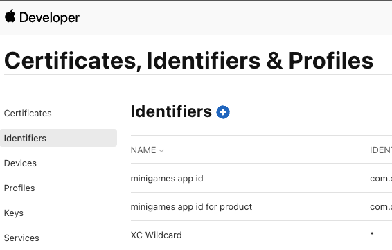

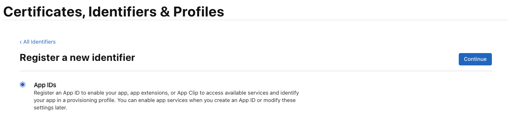

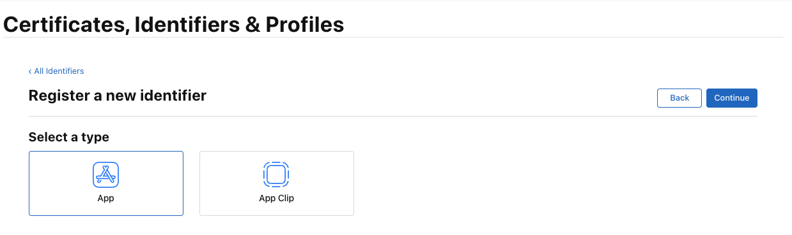

BundleIdを入力します。
今回は通知を使うのでPushNotificationsにチェックを入れるのを忘れないでください

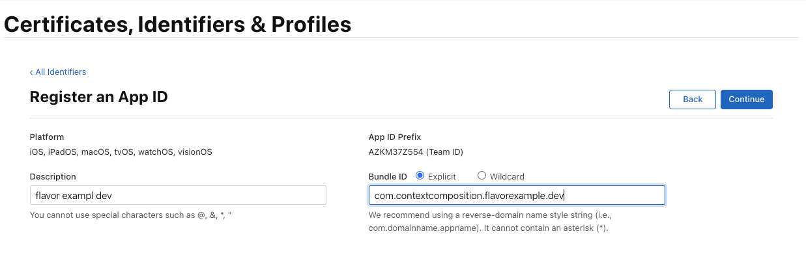

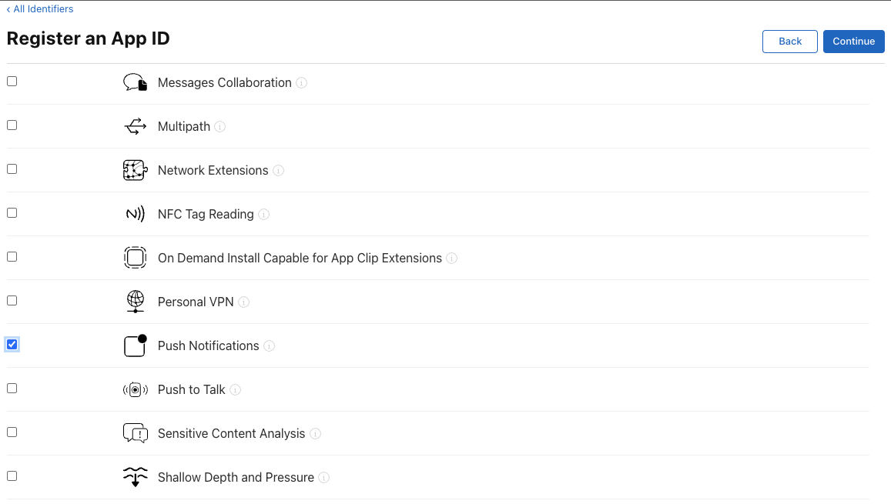

次はProfileの+ボタンを押します。

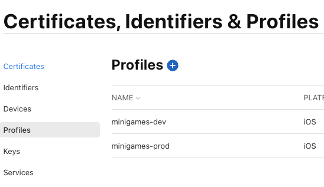

devのものを作っているのでiOSAppDevelopmentを選択してます。
作りたいものを選んでください
(Release-prodはApp Store Connectを選ぶなど)

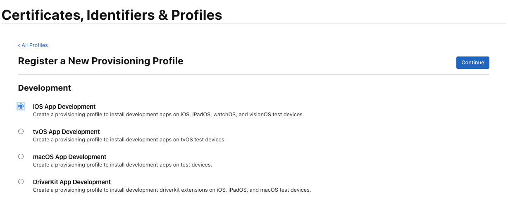

先ほど作成したIDを選びます
あとは道なりに進んでProvisioningProfile作成します。

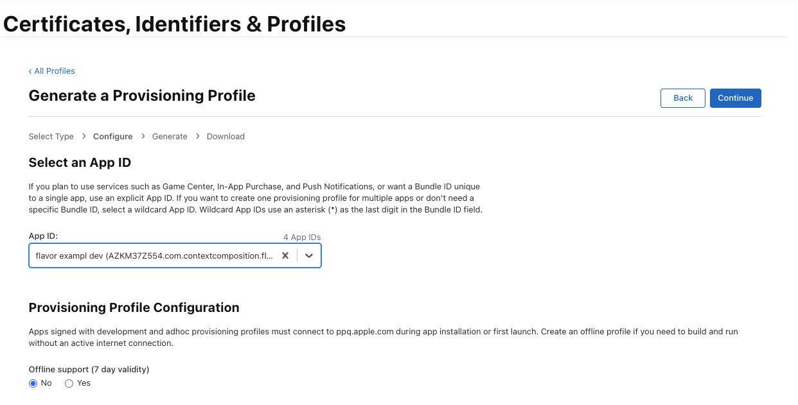
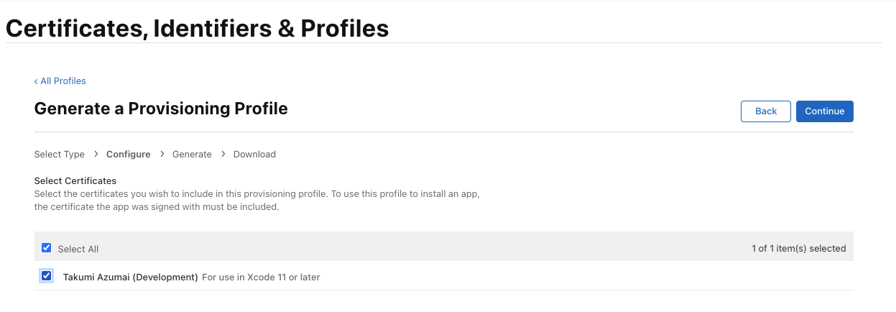
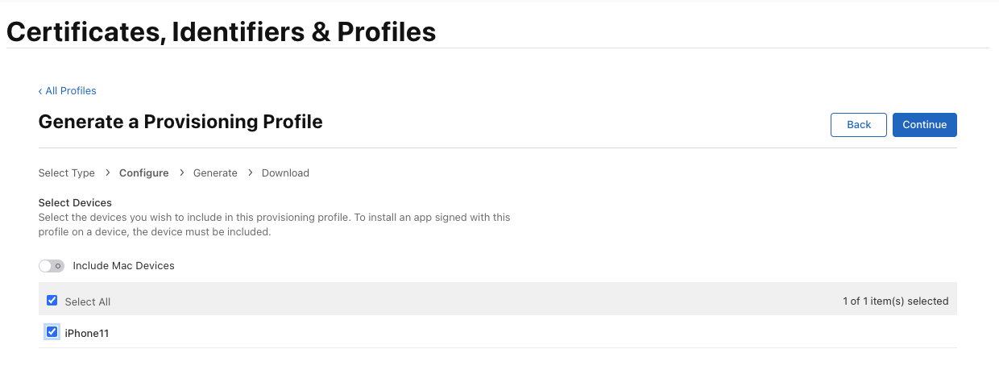
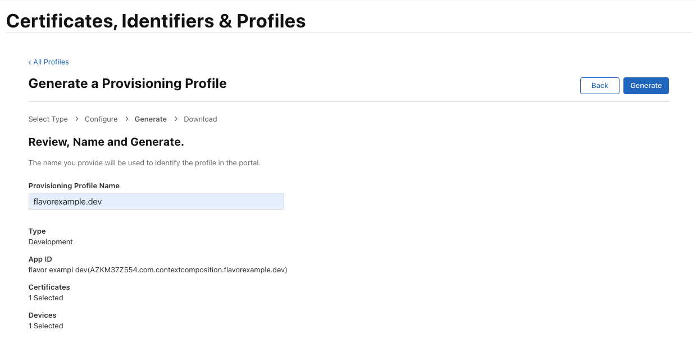
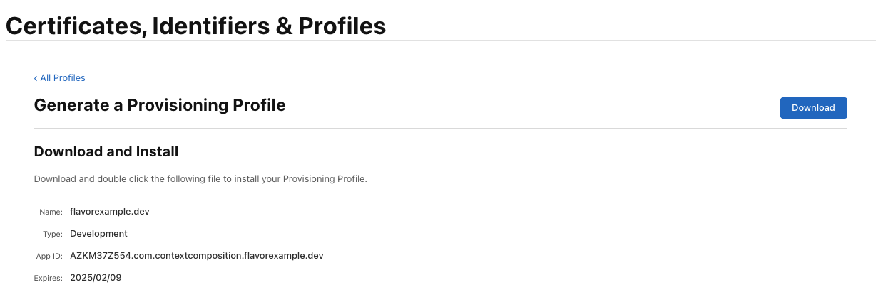

これを環境分繰り返します。
作成したらXcodeのSigningの設定をします。
環境変数がビルド時に変わるので、
appIdSuffixの値が".dev"の時にstg環境を設定するとエラーメッセージが表示されますがビルドは通るはずです。
ProvisioningProfileの候補が出ないと思うので、`ios/Flutter/Generated.xcconfig`のappIdSuffixを編集しながら設定すると楽です。


二重管理が気にならないのであれば、
appIdSuffixを使用せずに環境ごとにBundleIdに固定値を入れても良いと思います

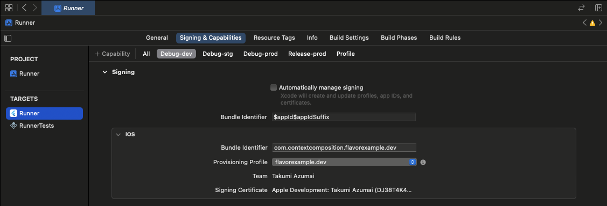

これで環境を選択してビルドが通ると思います。

一応以下のコミットですが、iOSの設定ファイルの差分を読むのは個人的に大変だと思います
[commint: iosで環境変数を使う](https://github.com/shirobutton/flutter_flavor_example/commit/bdfaf485a609646560d95954a55900c5603e3517)
[commint: iOSの環境分け](https://github.com/shirobutton/flutter_flavor_example/commit/a9b74d6665b3a63e9a6fa8ce9c72822c1ff0d54b)

# Firebase Cloud Messageの設定

ここからFCMの設定をします。
まずはpubspecにFCM用の依存関係を追加します。
`flutter pub get`するとiOS用のPodFileなどが生成されますね
[commint: pubspecにfirebaseの依存関係を追加](https://github.com/shirobutton/flutter_flavor_example/commit/e6ae77605392d2285d8e3c184559bc1255878394)

flutterのメイン関数に最低限動作確認用のコードを追加します。
FirebaseMessaging.onMessageで通知がStreamで取得できるので、listenなどできます。
これ自体で端末に通知が届くわけではないので、端末に通知を表示したい場合は、
別途`flutter_local_notifications`などで実装する必要があります。
[commint: main関数にFirebase用のコードを追加](https://github.com/shirobutton/flutter_flavor_example/commit/c40860eb8d42474ad085177d8c9bea37f324f8a3)

ではFirebaseConsoleを開きます
https://console.firebase.google.com/?hl=ja

プロジェクトを追加します。
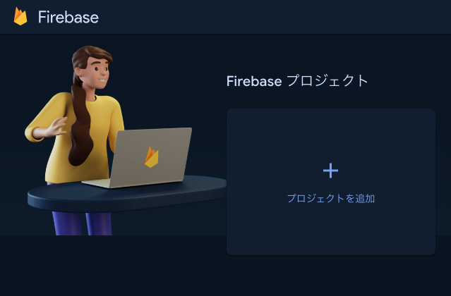

プロジェクトに名前をつけます。
とりあえずdevのプロジェクトを作成します。

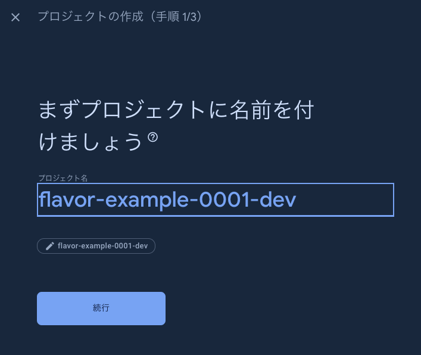

Googleアナリティクスと連携するかどうか聞かれるので答えます。
今回は使わないです。

プロジェクトを作成をクリックします。

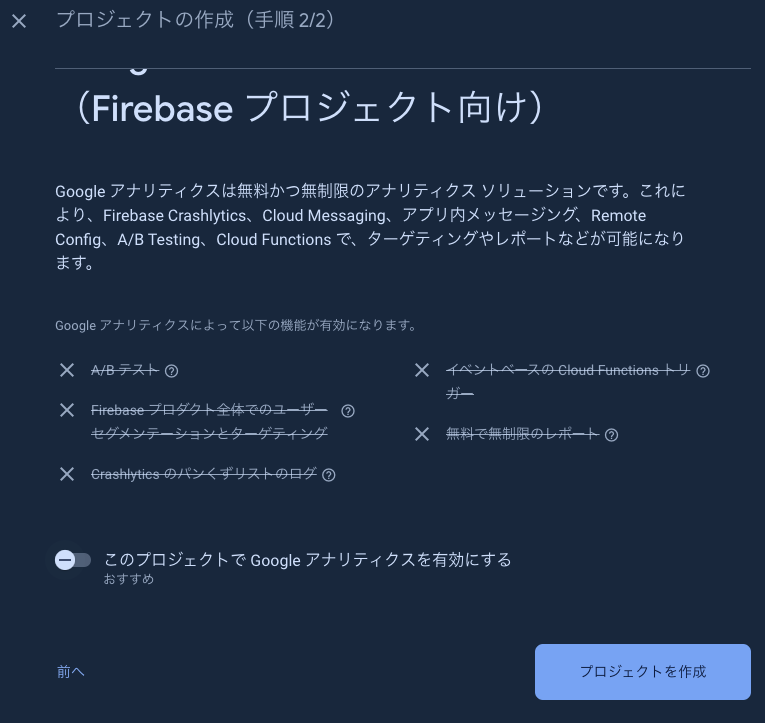

しばらくするとプロジェクトが作成されます。

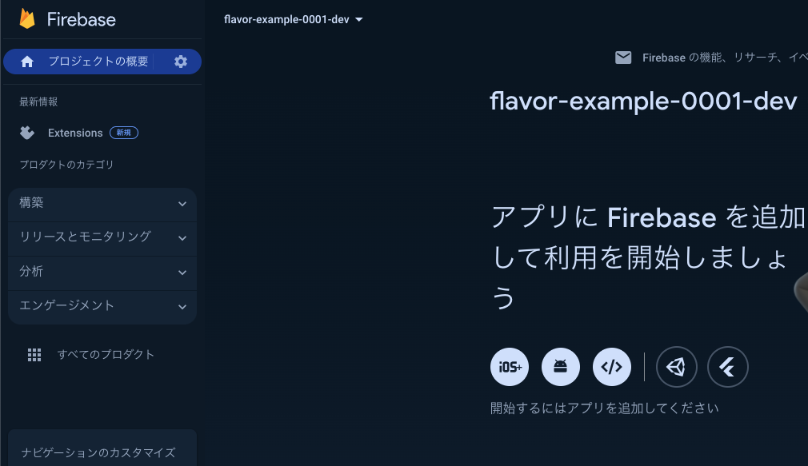

## AndroidのFirebase設定

Androidのアイコンを押します。(Flutterではない)

SHAは入力しなくて良いです。
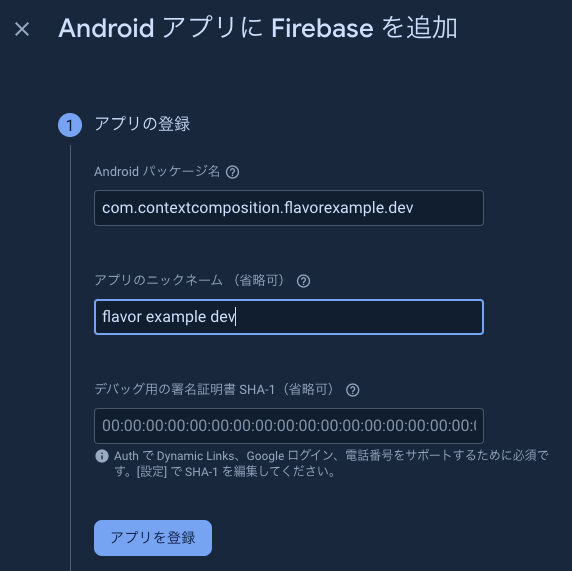

google-services.jsonをダウンロードします。
これがAndroid用のFirebaseの設定ファイルです。
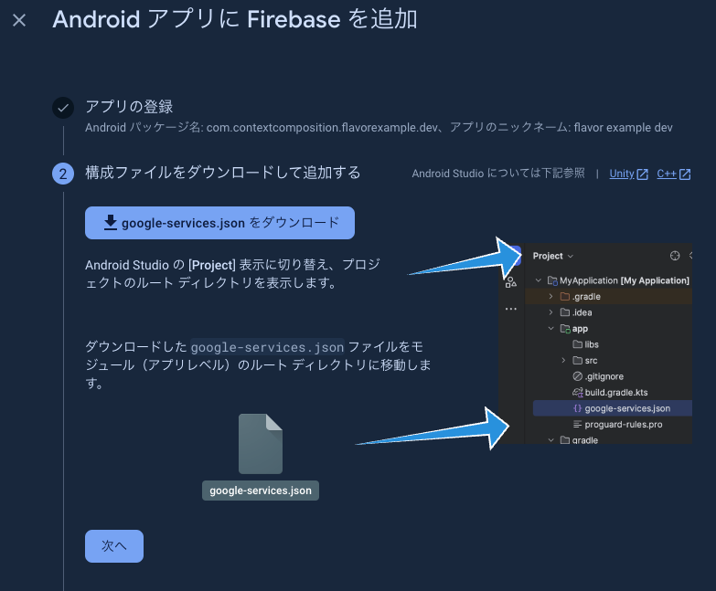

あとは無視してコンソールに進むまでします。
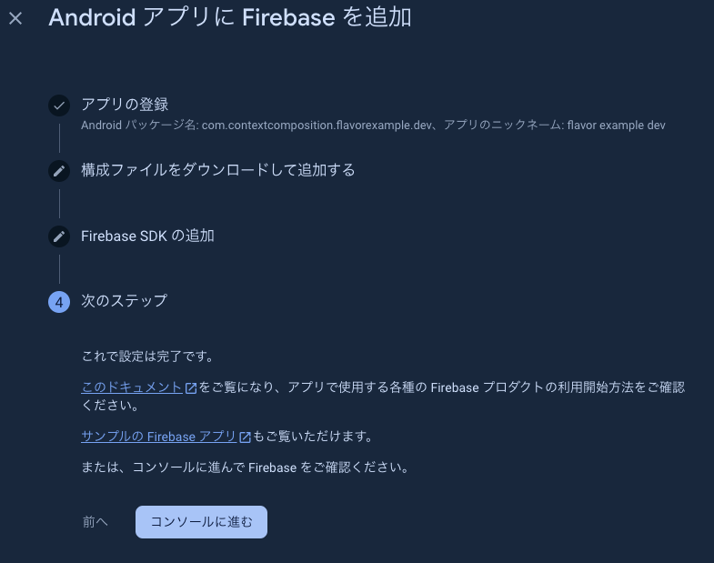

ダウンロードしたgoogle-services.jsonを`android/app/src/{flavor}/`ディレクトリに入れます。
devであれば環境であれば`android/app/src/dev/google-services.json`のようになっていればいいです。
[commint: Androidのdev環境のgoogle-service.jsonを追加](https://github.com/shirobutton/flutter_flavor_example/commit/4ab3cd398d11f7878a70e50ba5400cce4fc31858)

次にAndroidにFirebaseの依存関係を追加します。
[commint: AndroidにFirebase用の依存関係を追加](https://github.com/shirobutton/flutter_flavor_example/commit/c8b194289a5d2f42ed63ad5e1e4cbf82d817f303)

あとついでにAndroidマニフェストを統合しておきます。
[AndroidManifest統合](https://github.com/shirobutton/flutter_flavor_example/commit/c020e2ef27b48f071ed66fd9fe72abd08b970d18)

これで起動するとデバッグコンソールにFCMのトークンが表示されると思います。

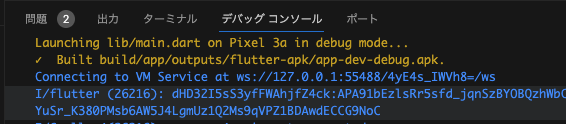

このトークンを使用してテストしてみます。

FirebaceConsoleにもどりMessagingのページに行きます

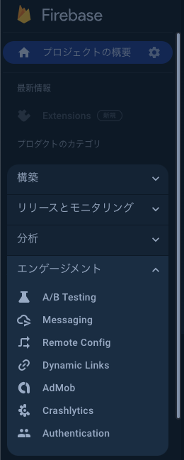

最初のキャンペーンを作成をクリックします。

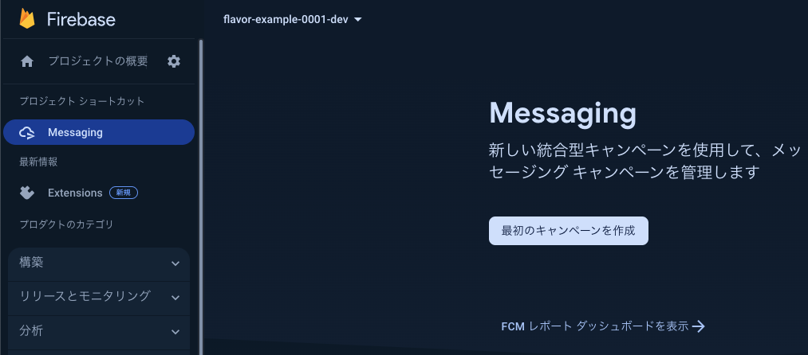

Firebase Notification メッセージを選択します。

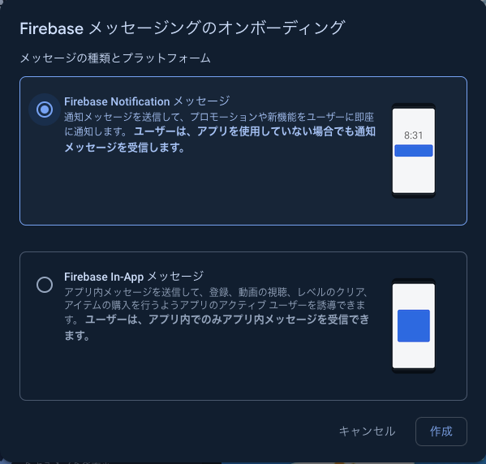

適当にタイトルとテキストを入力して「テストメッセージを送信」をクリックします。

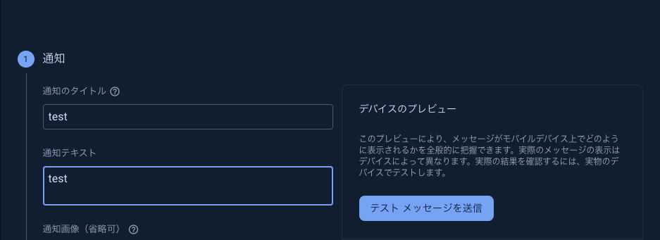

デバイストークンを入力する欄が出てくるので先ほどのトークンをペーストして＋ボタンを押し、「テスト」ボタンを押します。

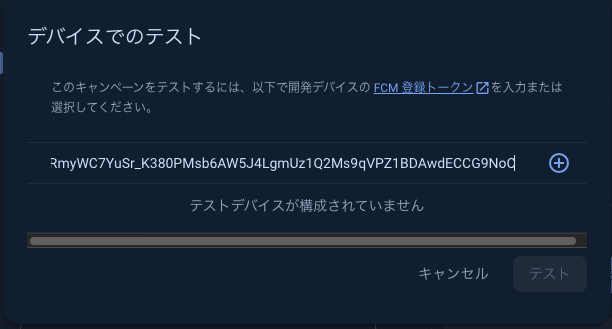

デバッグコンソールに以下のようなログが表示されれば受信成功です。
`Message title: test, body: test data: {}`

## iOSのFirebase設定

### APNsKeyの生成

まずはAPNsKeyの設定をします。
AppleDeveloperのkeysを開き、＋ボタンを押します。
https://developer.apple.com/account/resources/authkeys/list

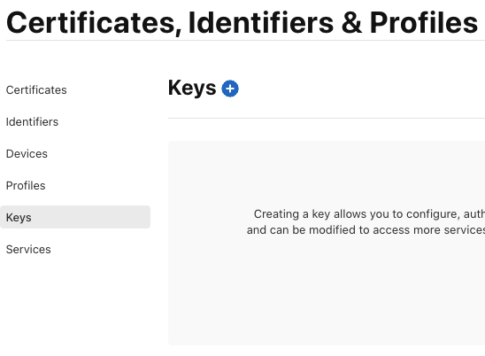

KeyNameを入力しApple Push Notifications service (APNs)にチェックを入れて進みます。

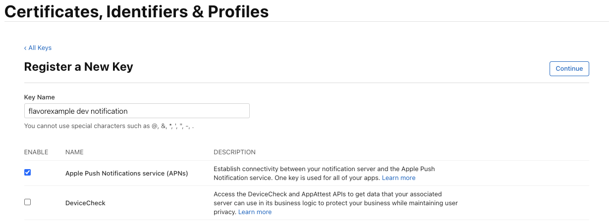

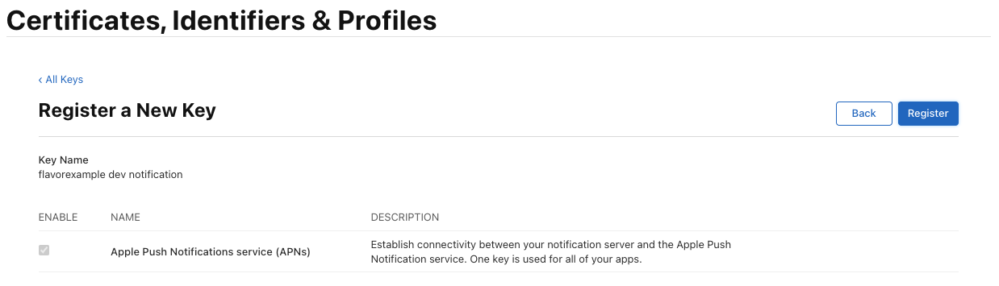

APNsKeyが生成されたのでダウンロードします。
一回しかダウンロードできないので注意してください(作り直すことはできる)
あとここに書いてあるKeyIDは後で使います。
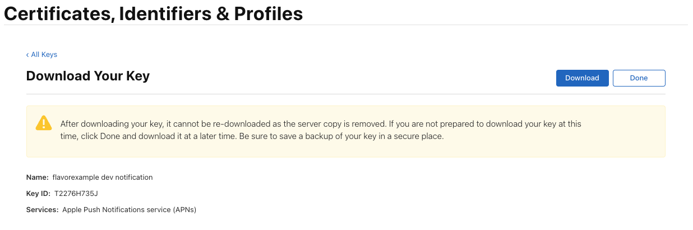

### FirebaseConsoleでiOSの設定

次にFirebaseConsoleでiOSの設定をします。
プロジェクトの概要を開いて、＋アプリを追加を押します

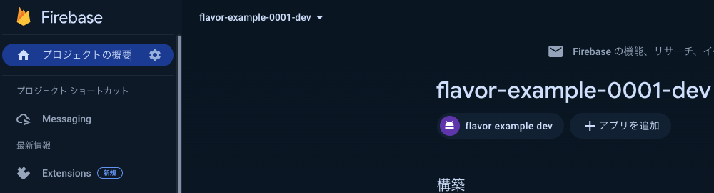

iOSのアイコンを押します。

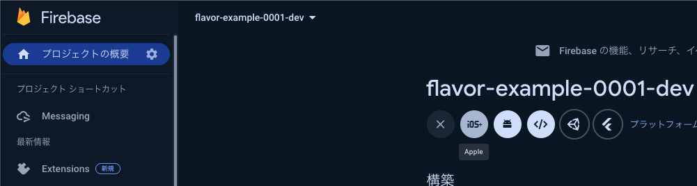

Androidの時と同じように進めます。

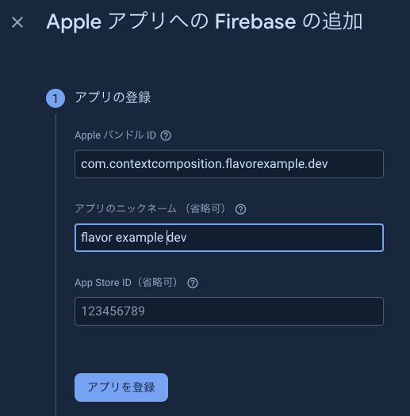

GoogleService-Info.plistをダウンロード

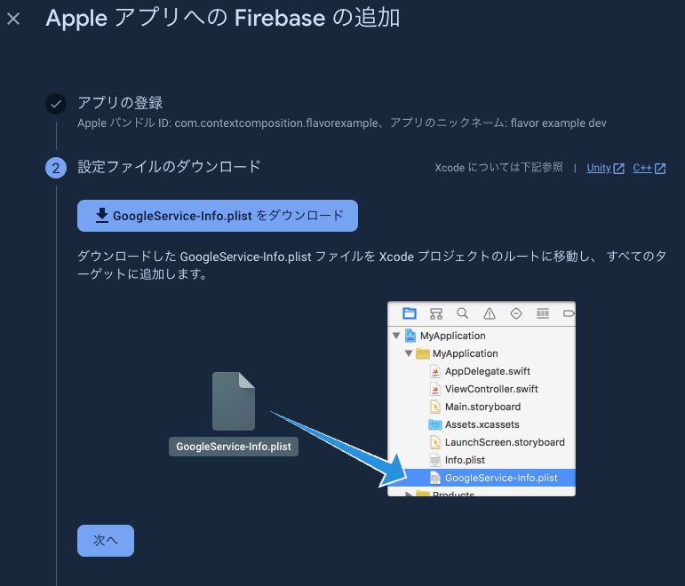

他は無視してコンソールに進みます。
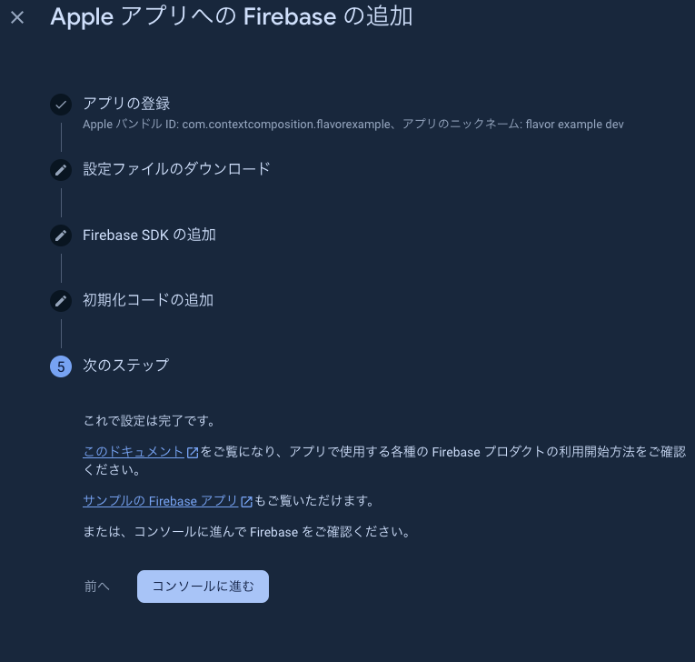

次にプロジェクトの設定から、CloudMessageタブを開きます
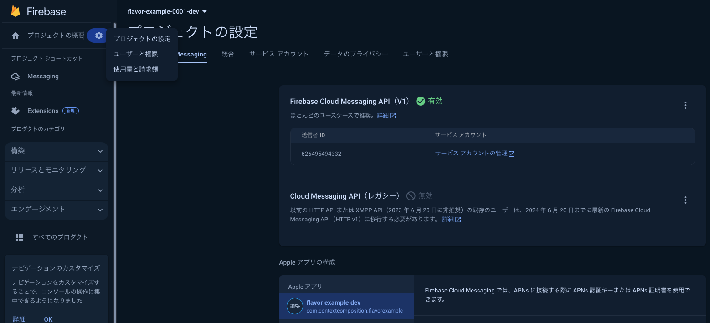

少し下にスクロールすると先ほど作成したiOSのアプリの情報があり、
APNs認証キーがありませんとなっています。
そのアップロードボタンを押します。
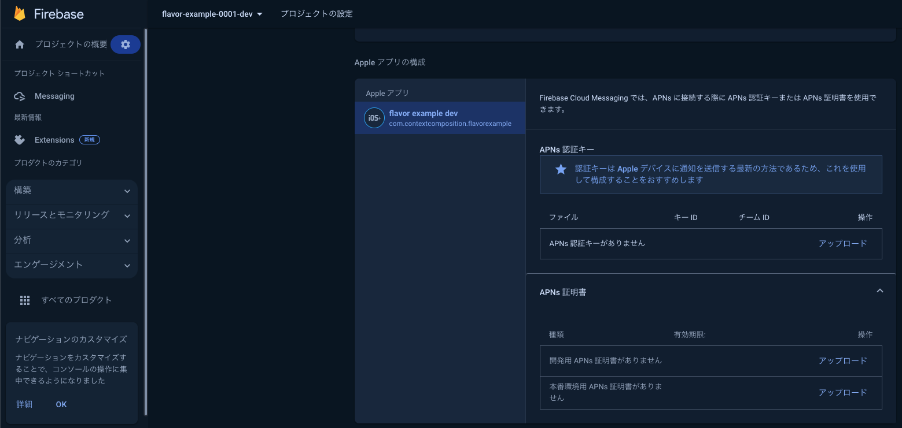

ダイアログが開くので先ほどのAPNsキーをアップロードし、
キーIDとチームIDを入力します。
キーIDはAPNsキーを作成した際に表示されていたKeyIDです。
チームIDはAppleDeveloperのアカウントのメンバーシップの詳細に書いてあります。
https://developer.apple.com/account

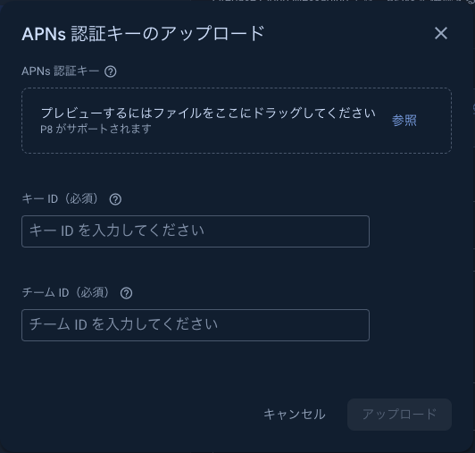

### XcodeでFCM用の設定

まず先ほどダウンロードしたGoogleService-Info.plistを`ios/flavor/${flavor}/`ディレクトリに入れます。
devであれば`ios/flavor/dev/GoogleService-Info.plist`となっていれば良いです。

次にiosディレクトリにあるPodfileにFCM用の依存関係を追加します。
[iOSにFirebase用の依存関係を追加](https://github.com/shirobutton/flutter_flavor_example/commit/b2fa4d8e3d73c251e29f4fc56a14ceb74cbdba4d)

次にXcodeでPushNotificationsの設定をします。

「All」の環境を選択した状態で
「＋Capability」のボタンをクリックしてPush Notificationを選択します。

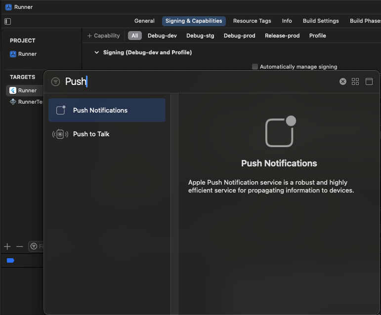

次にBuildPhasesの＋ボタンを押して、NewRunScriptPhaseを選択します。

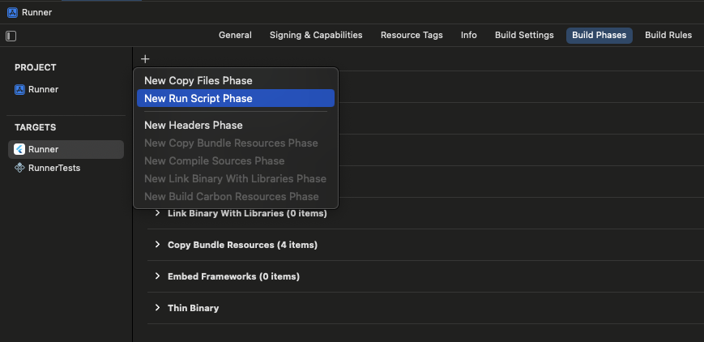

このコードをコピペします。
```
cp -r "${PROJECT_DIR}/flavor/${flavor}/GoogleService-Info.plist" "${BUILT_PRODUCTS_DIR}/${PRODUCT_NAME}.app/GoogleService-Info.plist"
```

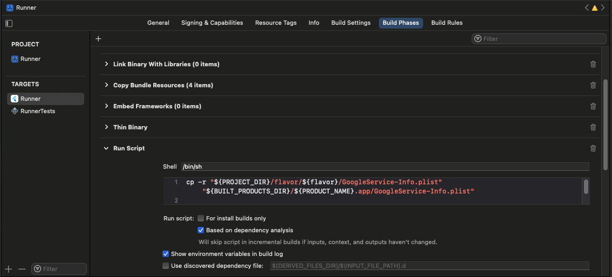

これでiOSでもFCMが使えるようになりました。
起動するとトークンが表示されるのでAndroidと同じようにテストできます。

# おわりに

これでFCMを含めた環境分けができました。
FCMについてはdev環境のものしか設定していませんが、同じ手順を欲しい環境分繰り返せば問題ないです。

環境を切り替えた後にちゃんと通知が届いているか確認しましょう。

最後にもう一度言いますが、これだけでは端末に通知が表示されないので、
端末に通知を表示したい場合は別途`flutter_local_notifications`などで実装してください。